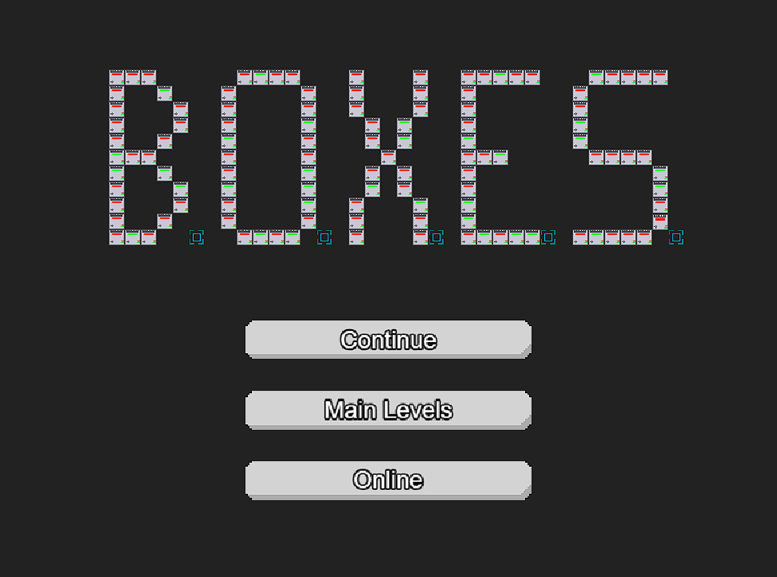
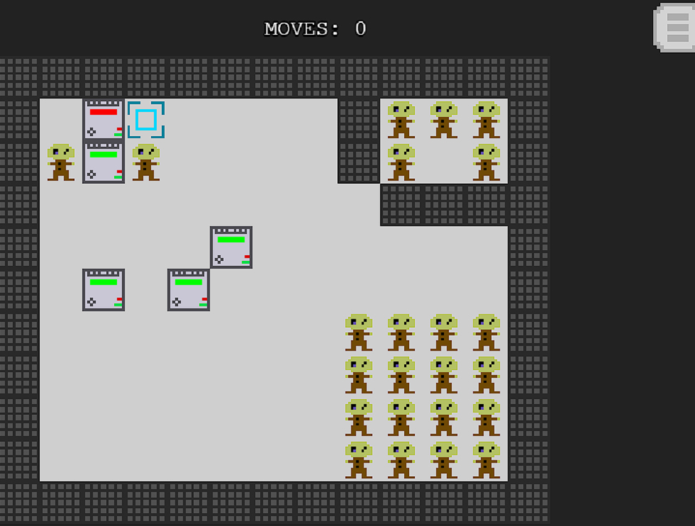

 

 Boxes

Welcome to 'Boxes! This game, inspired by the classic puzzle game Sokoban, challenges players to move boxes to designated locations through strategic planning and problem-solving. Developed as a part of our Software Engineering course (CMSC 447) Prof. Nick Allgood. This game made by: Abdulrahman Almuwarraee, Aidan Brown, Joss Blumberg, Jonathan Andersen-Taylor, and Jet Thompson.

Game Description

Navigate through a series of increasingly challenging levels each designed to test your puzzle-solving skills. In 'Boxes', your goal is to push boxes to their correct positions on the grid. Plan your moves carefully – every level has its own set of challenges and there's limited space to make your moves.

Sprint 1: Design
Focused on planning and designing the game, which included requirements analysis, creating class diagrams, UML, and database, activity diagrams. Use case diagrams (No Code Yet).
Sprint 2 & 3: Build, Test, Integrate, and Deploy
•	Core Development & Testing:
•	The bulk of coding, including initial functionality and game mechanics.
•	Comprehensive testing to ensure gameplay worked as intended and integration of different game components.
Running the Game:
  - Fire up our game with Flask by running `run.py` from `code/src/run.py`. Then, head to `127.0.0.1:8000` on your web browser to start the game.

Key Features:
  Extra Levels: Hit "Play" from the main menu to navigate your avatar using "WASD" or arrow keys. Challenge yourself to move all boxes to their spots. 
  Level Editor: Feeling creative? Click "Editor" on the main menu and use your mouse to design your own puzzling levels.

How to Start the Game:
   The main menu is your gateway. From here, choose to play or edit levels. Control your character using keyboard inputs and navigate through the puzzles with strategic prowess.

Ready to move some boxes?
